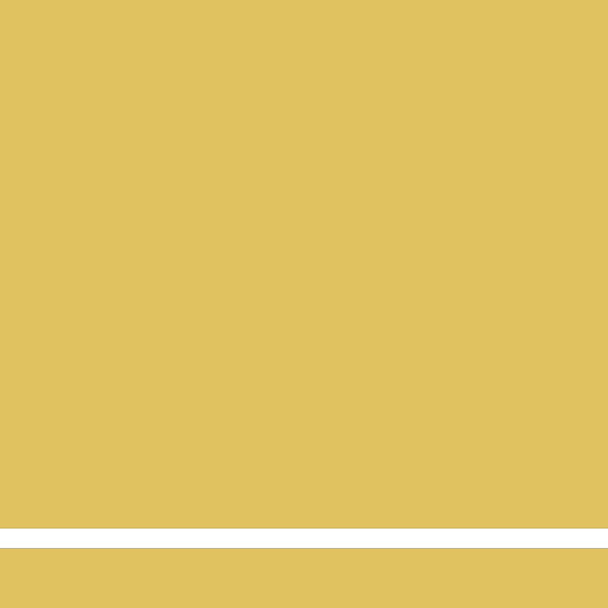
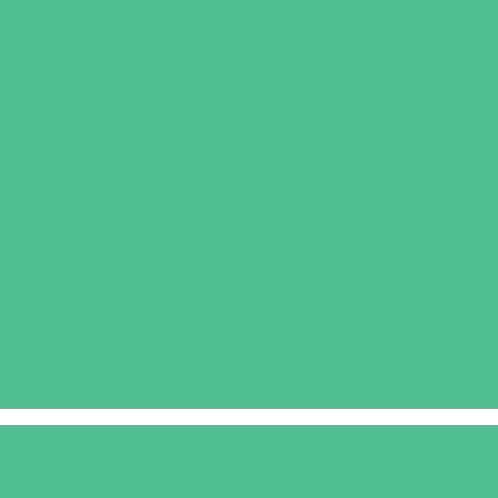

# lenti [![NPM version][npm-image]][npm-url] [![Build Status][travis-image]][travis-url] [![Dependency Status][daviddm-image]][daviddm-url] [![Coverage percentage][coveralls-image]][coveralls-url]
> Lenticular image viewer

Lenti is an image viewer that mimicks the effect of lenticular printing. It displays images in a canvas element and binds events for mouse and accelerometer events, so just as you would rotate a card or print with lenticular lenses on it, you can tilt your phone to transition between images.

**[Demo][demo-page]**

## Installation

```sh
$ npm install --save lenti
```

## Browser Support

<picture>
<source type="image/webp" srcset="https://caniuse.bitsofco.de/image/webgpu.webp">
<source type="image/png" srcset="https://caniuse.bitsofco.de/image/webgpu.png">

</picture>

_Thanks to Ire for their [Can I Use Embed](https://caniuse.bitsofco.de/#how-to-use)_

## Basic Usage

Lenti will accomodate any number of images in the container (be good to your RAM and don’t go wild, though).

```html
<div data-lenticular-list="true" >
  
  
  
  
</div>
```

```js
import Lenti from 'lenti'

let lenticulars = document.querySelectorAll('[data-lenticular-list]')
let instances = []
// convert → array & loop through
;[...lenticulars].map((el, i) => {
  // store instance in array for further manipulation
  instances[i] = new Lenti({container: el, width: 1280, height: 720})
  // initialize instance
  instances[i].init()
})
```

## Options

#### `container`
**Required**

Specifies the HTMLElement (not selector) that contains the images.

#### `accelerometerEvents`
**default**: true

Turns tilt interaction on or off.

#### `mouseEvents`
**default**: true

Turns mouse hover interaction on or off.

#### `stripWidth`
**default**: 16

The horizontal width (in pixels) of each lens strip.

#### `height` & `width`
**default**: 50

The height and width of the canvas (in pixels). You **definitely should** match this to the value of your images (which should all be the same size)

#### `tiltMax`
**default**: 45
#### `tiltMin`
**default**: -45

For the accelerometer event listener, define the max and min tiltable angle for interaction.

## Instance Methods
#### `Lenti.init()`
Runs setup functions.
#### `Lenti.bindEvents()`
#### `Lenti.destroy()`
Binds (`bindEvents`) or unbinds (`destroy`) events.
#### `Lenti.handleSizing()`
Measures the sizing of the box for further calculations. By default the event bindings will call this on resize. If you are resizing a container manually, you should probably fire this.
#### `Lenti.getBoxPosition()`
#### `Lenti.checkVisibility()`
This
#### `Lenti.redraw(balance)`
Refreshes the viewer for the given `balance`, where `balance` is a float from `0–1` that represents the position in the image sequence. A value of 0 will show the first image, and a value of 1 will show the last. See [custom events](#custom-events) for an example of this.
#### `Lenti.remap(value, inLow, inHigh, outLow, outHigh)`
Helper function to map values from one range to another. You'll likely use this to map values to the range `0–1` for `Lenti.redraw()`.


## Custom events
Lenti doesn't make too many assumptions about your environment. You may turn off the default event handlers (see `accelerometerEvents` and `mouseEvents`) and make your own interaction system. Just send a value between 0–1 to your instance at `Lenti.redraw()`.

In the following example, we show how a spring physics library ([rebound](https://github.com/facebook/rebound-js)) can be used as a sort of middleware in Lenti:

```js
import Lenti from 'lenti'
import rebound from 'rebound'

let lenticulars = document.querySelectorAll('[data-lenticular-list]')
let instances = []
// convert → array & loop through
;[...lenticulars].map((el, i) => {
	const image = el.querySelector('img')
	// store instance in array for further manipulation
	instances[i] = new Lenti({
		container: el,
		width: image.width,
		height: image.height,
		stripWidth: el.getAttribute('data-strip-width'),
		mouseEvents: false // this is the key
	})
	let _this = instances[i]

	// set up spring
	const springSystem = new rebound.SpringSystem();
	const springConfig = [40, 9] // tension, friction
	const balanceSpring = springSystem.createSpring(...springConfig);
	balanceSpring.addListener({ onSpringUpdate: (balanceSpring) => {
		_this.redraw(balanceSpring.getCurrentValue())
	}})
	// initialize instance
	_this.init()

	// set initial value
	balanceSpring.setEndValue(1)

	// bind mouse events
	_this.canvas.addEventListener('mousemove', (e) => {
		const balance = _this.remap(e.offsetX / _this.canvasWidth, 0, 1, 1, 0)
		balanceSpring.setEndValue(balance)
	})
})
```
After disabling the default mouse event handler, we set up a new event listener (`mousemove`), map the value of `e.offsetX / _this.canvasWidth` to the range 1–0 (just inverting the range here), and send the value to `balanceSpring`, which interpolates the value. We tell `balanceSpring` to send the spring value to our instance method at `Lenti.redraw()` as it updates. Check the [demo page][demo-page] to see this example in use.

You can imagine that this example does not demonstrate the full flexibility you have here, and that you could, for instance, replace the default gamma-rotation accelerometer event with events for a different axis, use ambient light sensors to change the value, have timed animations driven by any arbitrary event, and so on.

## Cross-origin images
Because Lenti uses canvas to produce this effect, most browsers will be upset if you fetch an image from another origin. Be sure to set `crossorigin="anonymous"`  on your images:

```html

```

## License

Apache-2.0 © [Daniel Gamage](https://danielgamage.com)


[npm-image]: https://badge.fury.io/js/lenti.svg
[npm-url]: https://npmjs.org/package/lenti
[travis-image]: https://travis-ci.org/danielgamage/lenti.svg?branch=master
[travis-url]: https://travis-ci.org/danielgamage/lenti
[daviddm-image]: https://david-dm.org/danielgamage/lenti.svg?theme=shields.io
[daviddm-url]: https://david-dm.org/danielgamage/lenti
[coveralls-image]: https://coveralls.io/repos/danielgamage/lenti/badge.svg
[coveralls-url]: https://coveralls.io/r/danielgamage/lenti
[demo-page]: https://danielgamage.github.io/lenti/
